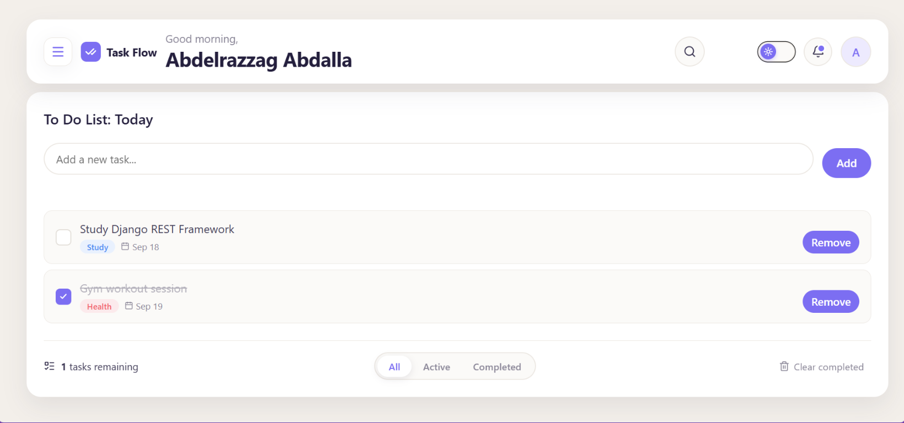
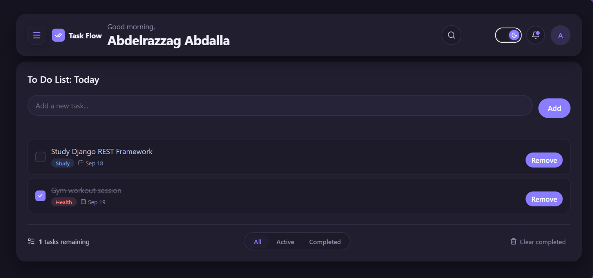
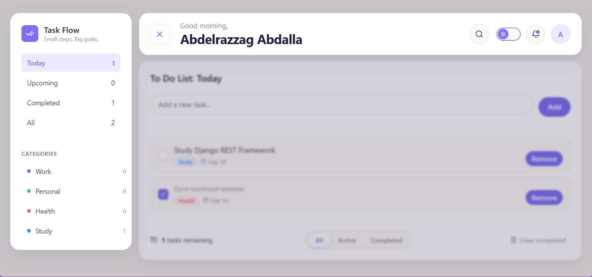
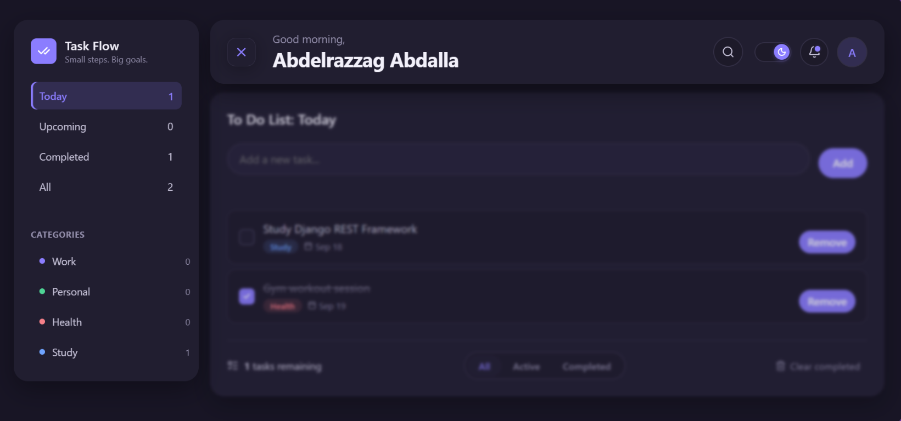
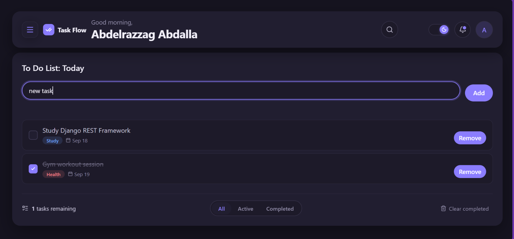
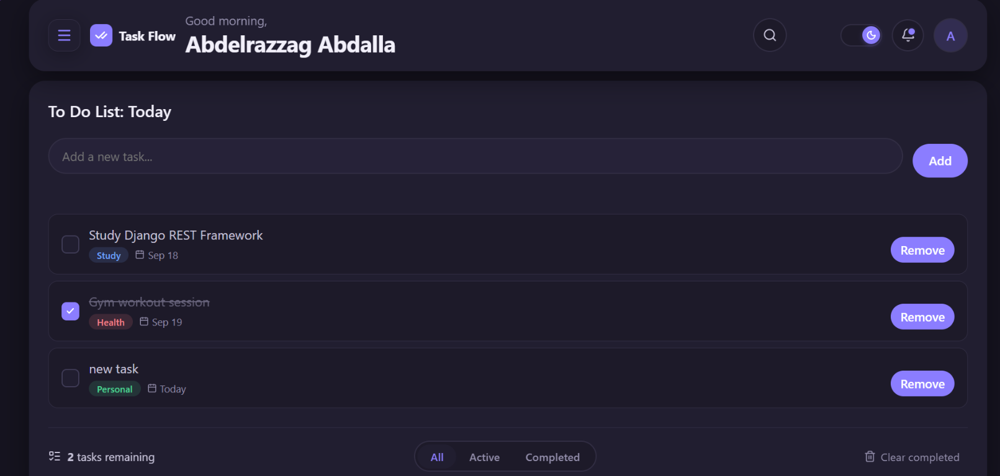
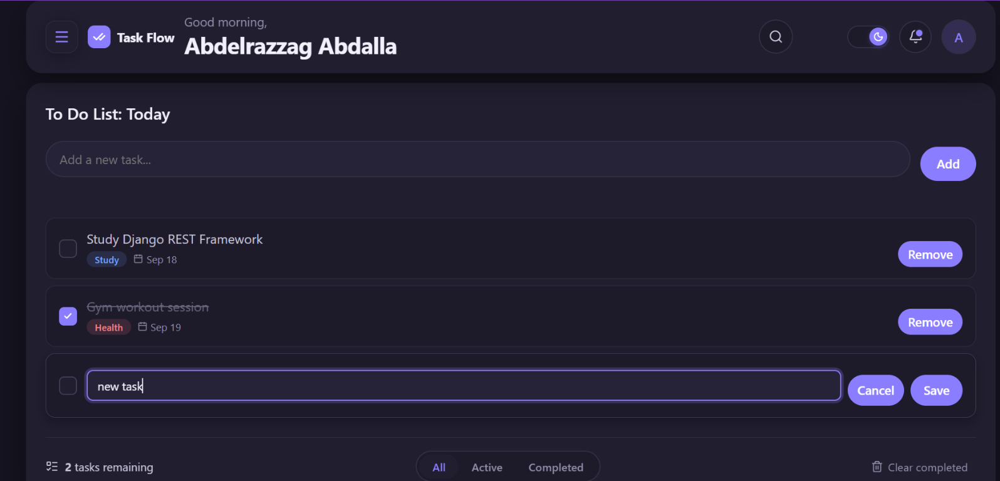
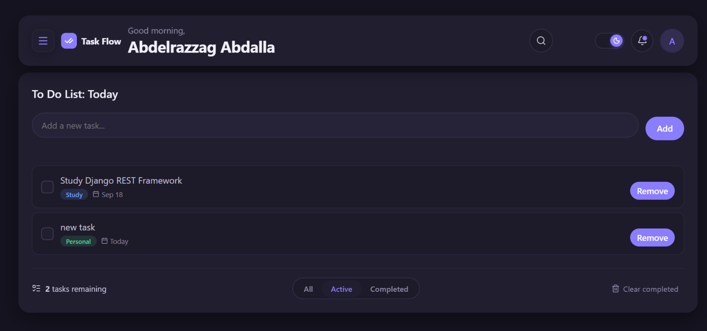

# Task Flow

Task Flow is a responsive React task-management interface built with Vite. It provides a focused workspace for creating, completing, editing, filtering, and removing tasks through a modern card-based UI.

The application currently runs entirely in the browser. Tasks are held in React component state for the current session, while the selected light or dark theme is persisted in `localStorage`.

Author: [Abdelrazzag Mohamed Elfatih A. Abdalla](https://github.com/abdelrazzag)

Repository: [github.com/abdelrazzag/task-flow](https://github.com/abdelrazzag/task-flow)

## Features

- Task creation from the task input or by pressing Enter
- Task completion toggling through:
  - The task checkbox
  - Clicking the task card
- Inline task editing:
  - Double-click a task title to edit it
  - Save changes with the Save button or Enter
  - Cancel changes with the Cancel button or Escape
  - Clicking outside an editing task cancels the edit
- Task removal with an animated removal state
- Clear all completed tasks from the footer
- Sidebar navigation for:
  - Today
  - Upcoming
  - Completed
  - All
- Category filtering for Work, Personal, Health, and Study
- Live task search through the collapsible header search control
- Search dismissal with outside click or Escape
- Runtime task counters for sidebar navigation and categories
- Footer filter tabs for All, Active, and Completed tasks
- Animated sliding indicator for the footer filter tabs
- Dynamic greeting based on the current local time:
  - `Good morning,` from 5:00 AM through 11:59 AM
  - `Good afternoon,` from 12:00 PM through 4:59 PM
  - `Good evening,` from 5:00 PM through 4:59 AM
- Collapsible sidebar with mobile overlay behavior
- Light and dark theme toggle
- Theme preference persistence through `localStorage`
- Responsive layout for desktop, tablet, and mobile widths
- Accessible labels for major interactive controls
- Reduced-motion support through the `prefers-reduced-motion` media query

## Current Application Behavior

- The initial task list contains two example tasks:
  - Study Django REST Framework
  - Gym workout session
- Newly created tasks are assigned to the Personal category and Today list by default.
- Task changes are not persisted between page reloads.
- The theme preference is persisted under the `taskflow-theme` `localStorage` key.
- The notification bell is currently a visual control and does not open a notification panel.
- The search filter currently matches task titles. Category text is displayed but is not included in the search predicate.
- The sidebar category entries are interactive controls styled as clickable elements; they do not currently expose button semantics.

## Tech Stack

- React 19
- React DOM 19
- Vite 8
- JavaScript with JSX
- CSS custom properties and responsive CSS
- `lucide-react` for interface icons
- ESLint 10 with React Hooks and React Refresh plugins

## Project Structure

```text
.
├── index.html
├── package.json
├── vite.config.js
└── src
    ├── App.jsx
    ├── App.css
    ├── index.css
    ├── main.jsx
    └── component
        ├── Header.jsx
        ├── Sidebar.jsx
        ├── TaskFooter.jsx
        ├── TaskInput.jsx
        ├── TaskItem.jsx
        ├── TaskList.jsx
        └── ToDo
            ├── ToDo.jsx
            └── todo.css
```

### Component Responsibilities

- `App.jsx`: Application entry component that renders the task workspace.
- `ToDo.jsx`: Owns task data, filters, theme state, search state, and task actions.
- `Header.jsx`: Renders the dynamic greeting, sidebar toggle, collapsible search, theme switch, notification control, and avatar.
- `Sidebar.jsx`: Renders the Task Flow brand, navigation filters, category filters, and live counters.
- `TaskInput.jsx`: Renders the task creation input and Add button.
- `TaskList.jsx`: Handles the empty state and maps tasks to task items.
- `TaskItem.jsx`: Handles completion, inline editing, removal animation, keyboard behavior, and outside-click cancellation.
- `TaskFooter.jsx`: Renders the remaining-task count, filter tabs, animated tab indicator, and clear-completed action.
- `todo.css`: Main feature stylesheet containing layout, theme tokens, responsive rules, transitions, task styles, and component styling.

## Getting Started

### Prerequisites

- Node.js 18 or newer
- npm

### Installation

Clone the repository and enter the project directory:

```bash
git clone https://github.com/abdelrazzag/task-flow.git
cd task-flow
```

Install the project dependencies:

```bash
npm install
```

### Development Server

Start the Vite development server:

```bash
npm run dev
```

Open the local URL printed by Vite, usually:

```text
http://localhost:5173
```

### Production Build

Create a production build:

```bash
npm run build
```

Preview the production build locally:

```bash
npm run preview
```

### Linting

Run ESLint across the project:

```bash
npm run lint
```

## Screenshots

### Default State

#### Light Theme



#### Dark Theme



### Sidebar Navigation

#### Light Theme



#### Dark Theme



### Task Input States

#### Focused Input



#### New Task Added



### Inline Editing



### Active Filter



## Styling Notes

Task Flow uses CSS custom properties for its color palette, spacing scale, radii, shadows, typography, and motion values. The main application styles are maintained in `src/component/ToDo/todo.css`, with global reset and root-level styles in `src/index.css` and `src/App.css`.

The UI uses a warm neutral light theme and a dark theme activated through the `dark-theme` class on the document root. Responsive rules switch the sidebar to an overlay drawer on smaller screens and reorganize the header and footer controls for narrow viewports.

## Development Notes

- The project does not currently use React Context, `useReducer`, an external state library, or a backend API.
- Task persistence can be added by replacing the current `useState` task model in `ToDo.jsx` with a persisted state layer or API integration.
- The current implementation intentionally keeps task state local to the main `ToDo` component because the application is a small single-list interface.
